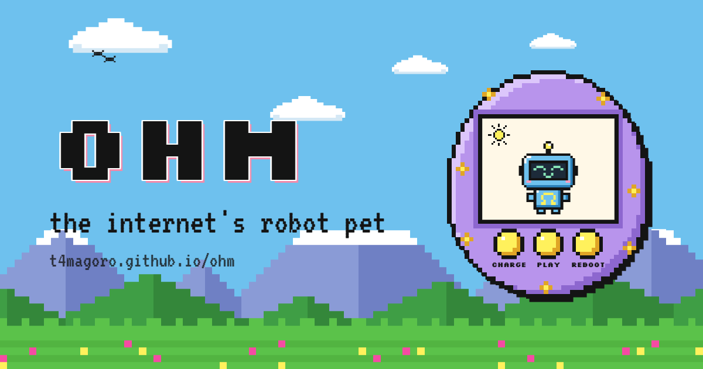

# ohm


I Create this project as just to experiment with markov chain algorithm i hope later i can add more feature to this project
since this is still an on going project but here it is the ohm robot projects.

**Ohm, the internet's robot pet**: one pixel robot shared by everyone online.
Visitors keep it alive together (Charge, Play, Reboot, or shake your phone), and they teach it to talk.

- Live site: https://t4magoro.github.io/ohm/ (Vitals: `/ohm/vitals`, admin: `/ohm/admin`)
- Backend: [`t4magoro/ohm-api`](https://github.com/t4magoro/ohm-api). Its README explains how Ohm learns to talk (a Markov chain).

## Stack

| Part | Tech |
|---|---|
| Framework | Next.js 16 (static export, `basePath: "/ohm"`), React 19, TypeScript |
| Styling | Tailwind CSS v4 + plain CSS in `src/styles/`, fonts Silkscreen and VT323 |
| Pixel art | Sprites are letter grids, drawn as SVG by `PixelArt` (no image files) |
| Live data | One WebSocket to the API (`src/hooks/useOhm.ts`) |
| Hosting | GitHub Pages, deployed by GitHub Actions |

## Running it

Everything runs in Docker. You don't need Node on the host.

1. Start the API first (see `ohm-api`), on http://localhost:8787.
2. Create `.env.development` (gitignored) with `NEXT_PUBLIC_API_URL=http://localhost:8787`.
3. Run `docker compose up -d`, then open http://localhost:3001/ohm.

| Task | Command |
|---|---|
| Lint | `docker compose exec web npm run lint` |
| Build (also typechecks) | `docker compose exec web npm run build` |
| After moving or adding folders | `docker compose restart web` (the dev server may not notice) |

Phone layout on a PC: Chrome DevTools, Ctrl+Shift+M.

## How it works

**One shared Ohm, live.** `useOhm` opens a WebSocket to the API and keeps it open. It reconnects after
1 s, 2 s, 4 s … up to 30 s, because every deploy drops all connections. The server sends each stat as
*value + moment + drain rate*, not a number that ticks. The page works out the current value itself
(`valueNow`) and re-renders once a second, so the bars drain smoothly without extra traffic.

**The page follows Bandung's real sky.** `skyOf()` in `src/lib/ohmState.ts` picks `day`, `rain` or `night`
from the live weather. `<main data-sky="…">` switches the colors in `src/styles/theme.css`.
It ignores the OS dark mode on purpose.

**Phone vs desktop.**
- On phones it's a game screen that never scrolls: Ohm on top, a console with tabs below. While a text box
  has focus, Ohm and the tabs step aside and the chat fills the screen. This is pure CSS (`:has(input:focus)`),
  because iPhones don't shrink the page for the keyboard.
- On desktop it's three columns: Ohm | status + chat | feed + spellbook.

**Privacy.** Your own chat messages are never shown to other visitors. Only Ohm's replies are.
Your name and your last visit are kept in `localStorage`, for the "while you were away" banner.

## Drawing the pixel art

All art lives in `src/components/pixel/sprites/` as arrays of strings. One letter = one pixel,
and each letter is a color from `src/components/pixel/palette.ts`. `.` is transparent.

```ts
// sprites/icons.ts: the chat tab's heart icon, 7 × 6 (p = pink)
export const HEART = [".pp.pp.", "ppppppp", "ppppppp", ".ppppp.", "..ppp..", "...p..."];
```

`PixelArt` turns the grid into one SVG path per color, so the sprites stay crisp at any size.
Many sprites are still placeholders (Ohm's body, faces and parts, the sky, the icons): redraw them there.
The tab icon `src/app/icon.png` is a separate image and doesn't update when Ohm is redrawn.

## Folder layout

One file = one job, named after the job.

```
src/
  app/              routes only: home, vitals/, admin/, layout.tsx, icon.png
  components/
    sections/       parts of the home page (Pet, StatusCard, Chat, Feed, Spellbook, …)
    ui/             small shared pieces (StatBar, Log, Skeleton, TabBar, Toast)
    pixel/          drawing: PixelArt, palette, OhmSprite, Sky, Device (the egg), Backdrop
    pixel/sprites/  all the pixel art, as letter grids
    charts/         Vitals charts (ChartFrame, StepChart, BarChart)
    vitals/         Vitals page parts (Milestones, TopWords)
    admin/          admin page parts
  content/          the text on the page, kept out of the components
  hooks/            useOhm (live connection), useShake
  lib/              protocol.ts (copy of the API's), ohmState.ts, format.ts, adminApi.ts
  styles/           theme (colors, fonts, skies), animations, components, terminal
```

`src/lib/protocol.ts` is an **exact copy** of `ohm-api/src/protocol.ts`. Change the API's copy first,
deploy the API, then copy the file here.

## Deploying

`.github/workflows/deploy.yml` runs lint and `next build` on every pull request and push to `main`,
with `NEXT_PUBLIC_API_URL` from the repository variables. It's read at build time, not at runtime.
Only `main` is published to GitHub Pages.
